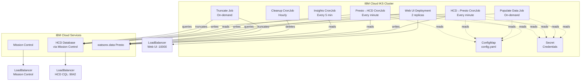

# Kubernetes Migration Plan: Affiliate Junction Demo

**Status**: Planning Phase  
**Target**: IBM Cloud IKS Deployment  
**Approach**: Kustomize + Hybrid Execution + ConfigMap + Secrets  
**Date**: 2026-04-30

---

## Executive Summary

Migration plan to convert the single VM systemd-based deployment to a modern Kubernetes-based architecture on IBM Cloud IKS, using Kustomize overlays, hybrid execution patterns (Deployments, Jobs, CronJobs), and cloud-native best practices.

---

## Table of Contents

1. [Architecture Overview](#architecture-overview)
2. [Kubernetes Architecture Design](#kubernetes-architecture-design)
3. [Directory Structure](#directory-structure)
4. [Configuration Management](#configuration-management)
5. [setup.sh Enhancement Plan](#setupsh-enhancement-plan)
6. [Kubernetes Manifest Specifications](#kubernetes-manifest-specifications)
7. [Python Code Updates](#python-code-updates)
8. [Migration Execution Plan](#migration-execution-plan)
9. [Workshop Documentation](#workshop-documentation)
10. [Security Best Practices](#security-best-practices)
11. [Success Criteria](#success-criteria)

---

## Architecture Overview

### Current State (Single VM)

- **Runtime**: systemd services on RHEL 9.6
- **Services**: 6 Python services + FastAPI web UI
- **Config**: `.env` file with hardcoded values
- **Database**: HCD at `172.17.0.1`, Presto at `ibm-lh-presto-svc`
- **Deployment**: Manual [`setup.sh`](setup.sh:1) script
- **Service Management**: systemd units with dependencies

### Target State (Kubernetes)

- **Runtime**: IBM Cloud IKS cluster with 3 worker nodes (bx2.4x16)
- **Workloads**: Deployment (UI), Jobs (data ops), CronJobs (ETL)
- **Config**: ConfigMap-mounted `config.yaml` + Kubernetes Secrets
- **Database**: K8s Services for discovery, external endpoints for IBM Cloud services
- **Deployment**: Automated [`setup.sh`](setup.sh:1) with full infrastructure provisioning
- **Service Management**: Kubernetes native scheduling and orchestration

### Key Architectural Decisions

1. **Kustomize over Helm**: Simpler for workshop/demo, easier to inspect, can add Helm later
2. **Hybrid Execution**: Match workload characteristics to K8s resource types
3. **ConfigMap for Config**: Separate configuration from code, domain-specific overlays
4. **Secrets for Credentials**: Secure credential management, generated by setup.sh
5. **K8s Services**: Use DNS-based service discovery for internal components

---

## Kubernetes Architecture Design

### Workload Mapping

| Current Service | K8s Resource | Schedule/Replicas | Purpose | Rationale |
|----------------|--------------|-------------------|---------|-----------|
| [`uvicorn.service`](uvicorn.service:1) | **Deployment** | 2 replicas | FastAPI web UI | Long-running, needs HA |
| [`generate_traffic.service`](generate_traffic.service:1) | **Job** | On-demand | Populate synthetic data | Bounded workload, UI-triggerable |
| [`hcd_to_presto.service`](hcd_to_presto.service:1) | **CronJob** | `*/1 * * * *` | ETL: HCD → Presto | Periodic, every minute |
| [`presto_to_hcd.service`](presto_to_hcd.service:1) | **CronJob** | `*/1 * * * *` | Materialization: Presto → HCD | Periodic, every minute |
| [`presto_insights.service`](presto_insights.service:1) | **CronJob** | `*/5 * * * *` | Analytics insights | Periodic, every 5 minutes |
| [`presto_cleanup.service`](presto_cleanup.service:1) | **CronJob** | `0 * * * *` | Data cleanup | Periodic, hourly |
| [`truncate_all_tables.service`](truncate_all_tables.service:1) | **Job** | On-demand | Reset operation | Operational action, UI-triggerable |

### Data Flow Architecture



---

## Directory Structure

```
affiliate-junction-labs/
├── .bob/
│   └── plans/
│       └── k8s-migration.md              # This document
│
├── k8s/                                   # Kubernetes manifests
│   ├── base/                              # Shared Kustomize base
│   │   ├── kustomization.yaml
│   │   ├── namespace.yaml
│   │   ├── configmap.yaml
│   │   ├── secret.yaml
│   │   ├── serviceaccount.yaml
│   │   ├── rbac.yaml
│   │   ├── deployment-web-ui.yaml
│   │   ├── service-web-ui.yaml
│   │   ├── job-populate-data.yaml
│   │   ├── job-truncate-tables.yaml
│   │   ├── cronjob-hcd-to-presto.yaml
│   │   ├── cronjob-presto-to-hcd.yaml
│   │   ├── cronjob-presto-insights.yaml
│   │   └── cronjob-presto-cleanup.yaml
│   │
│   └── overlays/
│       └── affiliate-junction/
│           ├── kustomization.yaml
│           ├── config-patch.yaml
│           └── resource-patches.yaml
│
├── config/
│   ├── config.yaml.example
│   ├── secrets.yaml.example
│   └── domains/
│       └── affiliate-junction/
│           └── domain.yaml
│
├── scripts/
│   ├── create_presto_catalog.sh
│   ├── test_hcd_connection.sh
│   └── test_presto_connection.sh
│
├── affiliate_common/
│   ├── config_loader.py                   # NEW
│   ├── database_connections.py            # UPDATED
│   └── [other files...]
│
├── setup.sh                               # UPDATED
├── Dockerfile                             # NEW
└── [existing files...]
```

---

## Configuration Management

### config.yaml Schema

```yaml
domain:
  name: affiliate-junction
  namespace: affiliate-junction
  
application:
  advertisers_count: 500
  publishers_count: 1000
  cookies_count: 5000
  history_mins: 90
  traffic_min: 5000
  sales_min: 500
  sales_buckets_count: 10
  fraud_cookies_count: 5
  cohorts: "TECH,FASHION,HEALTH,FINANCE,TRAVEL"
  cohort_same_probability: 0.60
  cohort_different_probability: 0.20
  fraud_cross_contamination_probability: 0.05
  random_cookie_probability: 0.15

web:
  port: 10000
  replicas: 2
  auth_user: watsonx
  
databases:
  hcd:
    service_name: hcd-service
    port: 9042
    datacenter: datacenter1
    keyspace: affiliate_junction
  presto:
    service_name: presto-service
    port: 8443
    catalog: iceberg_data
    schema: affiliate_junction
    use_ssl: true

schedules:
  hcd_to_presto: "*/1 * * * *"
  presto_to_hcd: "*/1 * * * *"
  presto_insights: "*/5 * * * *"
  presto_cleanup: "0 * * * *"
```

### Secrets (Kubernetes Secret)

```yaml
apiVersion: v1
kind: Secret
metadata:
  name: affiliate-junction-secrets
type: Opaque
stringData:
  HCD_USERNAME: cassandra
  HCD_PASSWORD: <generated>
  PRESTO_USERNAME: ibmlhadmin
  PRESTO_PASSWORD: <from-watsonx.data>
  WEB_AUTH_PASSWD: watsonx.data
  MC_LICENSE_ID: <user-provided>
```

---

## setup.sh Enhancement Plan

### Command-Line Interface

```bash
./setup.sh --domain <domain> --mission-control-license "<LICENSE>" [--phase <phase>]
```

### Execution Phases

1. **validate** - Validate configuration and prerequisites
2. **cloud** - Provision IBM Cloud infrastructure (VPC, IKS, Mission Control, HCD)
3. **presto** - Configure Presto catalog
4. **deploy** - Deploy application to Kubernetes
5. **test** - Run connectivity tests
6. **all** - Execute all phases (default)

### Key Implementation Steps

See full details in the complete plan document sections below.

---

## Implementation Checklist

- [ ] Create k8s/base/ directory with all manifests
- [ ] Create k8s/overlays/affiliate-junction/ with domain config
- [ ] Create config/config.yaml.example template
- [ ] Create Dockerfile for container image
- [ ] Update setup.sh with IBM Cloud provisioning
- [ ] Create affiliate_common/config_loader.py
- [ ] Update database_connections.py for K8s
- [ ] Add health endpoints to web/main.py
- [ ] Create scripts for Presto catalog and testing
- [ ] Document workshop procedures
- [ ] Test end-to-end deployment
- [ ] Create rollback procedures

---

## Next Steps

1. Review and approve this plan
2. Switch to Code mode to implement the changes
3. Create Kubernetes manifests
4. Update Python code for K8s compatibility
5. Enhance setup.sh script
6. Test deployment on IBM Cloud
7. Document workshop procedures

---

**Plan Status**: Ready for implementation approval